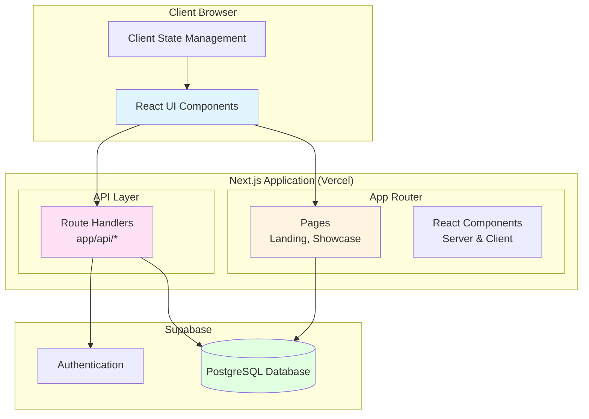
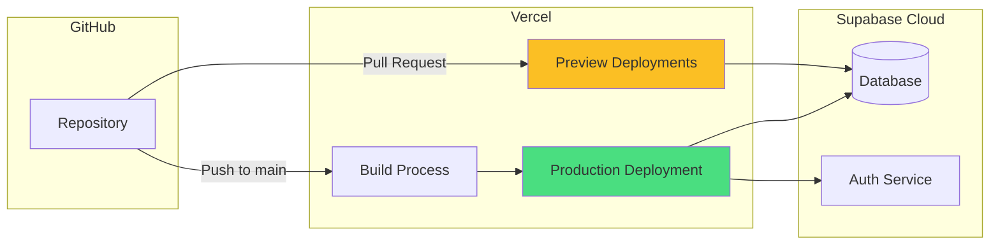
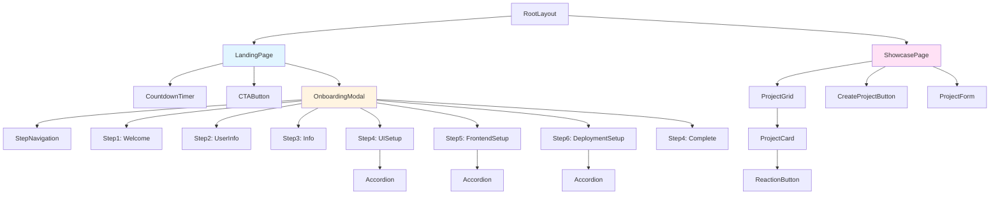
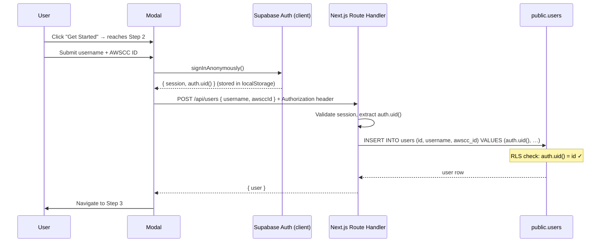

# Design Document: AWS Community Showcase

## Overview

The AWS Community Showcase is a fullstack Next.js 15+ application that enables AWS community members to share projects, complete guided onboarding, and engage with each other's work. The platform features a Linear.app-inspired aesthetic with smooth animations, a countdown timer for event awareness, and a comprehensive project showcase interface.

### Architecture Philosophy

The application follows a modern fullstack architecture using Next.js App Router with:

- **Server Components** for initial page loads and data fetching
- **Client Components** for interactive UI elements (countdown timer, modals, forms)
- **Route Handlers** (app/api directory) serving as the Backend API layer
- **Supabase** for database and authentication
- **Single deployment** to Vercel serving both frontend and backend

**Note on Backend API**: The requirements reference a "Backend_API" which is implemented using Next.js Route Handlers (app/api directory). This modern approach provides the same REST API functionality as a separate Express.js server but with better integration, type safety, and simplified deployment. All API endpoints specified in the requirements are implemented as Next.js Route Handlers.

This design prioritizes:

1. **Type Safety**: TypeScript throughout with strict mode enabled
2. **Performance**: Server-side rendering with selective client-side hydration
3. **User Experience**: Smooth animations and responsive design
4. **Maintainability**: Clear separation of concerns and modular components

## Architecture

### System Architecture Diagram



### Technology Stack

| Layer         | Technology                           | Version | Purpose                                                                |
| ------------- | ------------------------------------ | ------- | ---------------------------------------------------------------------- |
| Framework     | Next.js                              | 15.0+   | Fullstack React framework with App Router                              |
| Runtime       | React                                | 18.0+   | UI library with Server Components                                      |
| Language      | TypeScript                           | 5.0+    | Type-safe development                                                  |
| Database      | Supabase (PostgreSQL)                | 2.0+    | Data persistence and auth                                              |
| Styling       | Tailwind CSS                         | 4.0+    | Utility-first CSS framework                                            |
| UI Components | MagicUI (via shadcn CLI) + shadcn/ui | Latest  | Pre-built animated components, generated into `src/components/ui/`     |
| Animation     | Framer Motion / `motion`             | Latest  | Declarative animations (MagicUI components import from `motion/react`) |
| Deployment    | Vercel                               | Latest  | Hosting and CI/CD                                                      |

**Note 1 — Backend API**: Requirements mention Express.js (Req 20.2), but this design uses Next.js Route Handlers which provide equivalent REST API functionality with better integration and type safety. All Backend_API requirements (Req 10) are fulfilled by Route Handlers in the app/api directory.

**Note 2 — MagicUI installation**: MagicUI is not a single npm package. Components are pulled per-need from `https://magicui.design/r/<name>.json` via the shadcn CLI (`npx shadcn@latest add <url>`). The project ran `npx shadcn@latest init --defaults` to scaffold `components.json`, `src/lib/utils.ts`, and the shadcn `Button`. The first verification component installed was `blur-fade` (used later for staggered card animations in Req 16.4). This setup also brings shadcn/ui base components, which can be used alongside MagicUI for non-animated UI pieces.

**Note 3 — Tailwind v4 theming**: With Tailwind v4, design tokens live in CSS via `@theme inline` in `src/app/globals.css`, not in `tailwind.config.ts`'s `extend.colors`. The active palette is the cosmic theme (see Note 4); the JS config block is dead code and pending removal.

**Note 5 — Onboarding is a page route, not a modal**: The requirements call the onboarding flow "Onboarding_Modal" (Req 3, 16), but on 2026-05-01 the implementation moved from an in-page modal overlay to a dedicated `/welcome` route. The 7-step flow itself is unchanged (same step components, same `useOnboardingState` hook, same Property 2/3/4 navigation tests) — only the chrome around it changed. Trade-offs: the page is shareable + back-navigable + survives a refresh visually (auth/session in `localStorage` already does the heavy lifting on the data side), at the cost of losing the modal's "stay on the landing page" affordance. The CTA on the landing page becomes a `router.push('/welcome')` call. The Esc-to-close / X-button / backdrop affordances are gone; replaced with a small "← Back to home" link top-left.

**Note 4 — Theme: Cosmic ("From Vibe to Live")**: On 2026-05-01 the original Linear.app aesthetic was replaced with a dark cosmic theme matching the Figma design (`https://www.figma.com/design/KQ5EAw4koMfow6jzJCHdDQ/AWS--WEBDEV-Portfolio?node-id=16-6`) and the event poster. Dark-by-default. Token mapping in `src/app/globals.css`:

| Token                | Hex       | Source                      |
| -------------------- | --------- | --------------------------- |
| `--background`       | `#0a0518` | Near-black with purple tint |
| `--foreground`       | `#f5f3ff` | Off-white, violet-tinted    |
| `--card`             | `#1a0b2e` | Figma card base             |
| `--secondary`        | `#2c1250` | Figma elevated card         |
| `--primary`          | `#a855f7` | Vibrant violet (CTA)        |
| `--accent`           | `#ec4899` | Magenta (poster glow)       |
| `--muted-foreground` | `#b6a8d8` | Purple-tinted gray          |
| `--border`           | `#3b2069` | Subtle purple               |
| `--ring`             | `#c084fc` | Lighter violet (focus)      |
| `--glow-magenta`     | `#ff45c8` | Decorative-only             |
| `--glow-violet`      | `#9333ea` | Decorative-only             |
| `--glow-deep`        | `#4c1d95` | Decorative-only             |

Decorative utilities live in the same file: `.cosmic-bg` (radial-gradient base + corner glows via pseudo-elements), `.cosmic-stars` (CSS-generated starfield), `.cosmic-planet` + `.cosmic-float` (radial-gradient circles with optional floating animation). All decorations are pure CSS — no image assets — so they survive any future asset-pipeline changes and add zero network cost.

### Deployment Architecture



### Design Reference

**Figma Design**: [AWS WEBDEV Portfolio](https://www.figma.com/design/fEP7M48YI1rXC2b4O23iwa/AWS--WEBDEV-Portfolio--Copy-?node-id=16-6&m=dev)

The design follows a **Linear.app-inspired aesthetic** with:

- Clean, minimal interface with ample whitespace
- Subtle animations and transitions
- Modern typography and color palette
- Card-based layouts for content
- Smooth hover states and interactions

**Design System Principles** (from Figma):

- **Colors**: Defined in centralized theme configuration
- **Typography**: Consistent font families, sizes, and weights
- **Spacing**: 4px base unit system (4, 8, 16, 24, 32, 48, 64)
- **Components**: MagicUI components styled to match Figma specs
- **Animations**: Framer Motion for smooth, performant transitions

## Components and Interfaces

### Page Structure

The application follows Next.js App Router conventions with the following page structure:

```
app/
├── layout.tsx                 # Root layout with providers
├── page.tsx                   # Landing page (/)
├── showcase/
│   └── page.tsx              # Showcase page (/showcase)
├── api/                      # Route Handlers
│   ├── users/
│   │   ├── route.ts         # POST /api/users
│   │   └── [id]/
│   │       ├── route.ts     # GET /api/users/[id]
│   │       └── progress/
│   │           └── route.ts # PATCH /api/users/[id]/progress
│   ├── projects/
│   │   └── route.ts         # GET, POST /api/projects
│   └── reactions/
│       └── route.ts         # POST /api/reactions
└── components/              # Shared components
    ├── landing/
    ├── onboarding/
    └── showcase/
```

### Component Hierarchy



### Core Components

#### 1. Landing Page Components

**CountdownTimer** (Client Component)

```typescript
interface CountdownTimerProps {
  targetDate: string; // ISO 8601 format from env
}

interface TimeRemaining {
  days: number;
  hours: number;
  minutes: number;
  seconds: number;
}
```

**CTAButton** (Client Component)

```typescript
interface CTAButtonProps {
  onClick: () => void;
  label: string;
}
```

#### 2. Onboarding Modal Components

**OnboardingModal** (Client Component)

```typescript
interface OnboardingModalProps {
  isOpen: boolean;
  onClose: () => void;
  userId?: string; // For returning users
}

interface OnboardingState {
  currentStep: number; // 1-7
  formData: {
    username: string;
    awsccId: string;
  };
  completedSteps: Set<number>;
}
```

**StepNavigation** (Client Component)

```typescript
interface StepNavigationProps {
  currentStep: number;
  totalSteps: number;
  onNext: () => void;
  onBack: () => void;
  onStepClick: (step: number) => void;
  canProceed: boolean;
}
```

**UserInfoForm** (Client Component - Step 2)

```typescript
interface UserInfoFormProps {
  onSubmit: (data: UserFormData) => Promise<void>;
  initialData?: UserFormData;
}

interface UserFormData {
  username: string;
  awsccId: string;
}

interface ValidationErrors {
  username?: string;
  awsccId?: string;
}
```

**SetupStep** (Client Component - Steps 4, 5, 6)

```typescript
interface SetupStepProps {
  stepNumber: number;
  title: string;
  sections: AccordionSection[];
  isCompleted: boolean;
  onMarkComplete: (stepNumber: number) => Promise<void>;
}

interface AccordionSection {
  id: string;
  title: string;
  content: React.ReactNode;
}
```

#### 3. Showcase Page Components

**ProjectGrid** (Server Component with Client Islands)

```typescript
interface ProjectGridProps {
  initialProjects: Project[];
}
```

**ProjectCard** (Client Component)

```typescript
interface ProjectCardProps {
  project: Project;
  currentUserId: string;
  onReact: (projectId: string) => Promise<void>;
}
```

**CreateProjectButton** (Client Component)

```typescript
interface CreateProjectButtonProps {
  onClick: () => void;
}
```

**ProjectForm** (Client Component)

```typescript
interface ProjectFormProps {
  onSubmit: (data: ProjectFormData) => Promise<void>;
  onCancel: () => void;
}

interface ProjectFormData {
  title: string;
  description: string;
  mediaUrl?: string;
}
```

**ReactionButton** (Client Component)

```typescript
interface ReactionButtonProps {
  projectId: string;
  reactionCount: number;
  hasReacted: boolean;
  onReact: () => Promise<void>;
}
```

### State Management Strategy

The application uses a hybrid state management approach:

1. **Server State** (via React Server Components)
   - Initial page data (projects, user info)
   - Fetched directly in Server Components
   - No client-side state management library needed

2. **Client State** (via React hooks)
   - UI state (modal open/closed, form inputs)
   - Transient state (countdown timer)
   - Managed with `useState`, `useReducer`

3. **Form State** (via controlled components)
   - Form inputs and validation
   - Managed with `useState` and custom validation hooks

4. **Authentication State** (via Supabase client)
   - User session and authentication status
   - Managed by Supabase Auth client (anonymous sign-in, see Authentication Flow above)
   - Persisted in `localStorage` (Supabase JS client default with `persistSession: true`)
   - Accessed via a custom `useAuth()` hook from the AuthProvider context (see Task 21.1)

### Authentication Flow

**Strategy: anonymous Supabase sign-in + localStorage persistence.** This is a one-time event, no passwords or recovery flow. Users get a Supabase `auth.users` row via `signInAnonymously()` so RLS works (`auth.uid()` is populated for every request), and `public.users.id` is set equal to `auth.uid()` so the existing RLS policy `WITH CHECK (auth.uid() = id)` passes. Session persists in `localStorage` (Supabase JS client default when `persistSession: true`). If the browser clears localStorage, the user effectively becomes a new identity — acceptable for a finite event window.



**Important schema note:** the migration default `users.id UUID PRIMARY KEY DEFAULT gen_random_uuid()` should NOT be relied on for the onboarding insert path. The Route Handler MUST explicitly set `id` to the authenticated `auth.uid()`, otherwise the RLS policy in `005_enable_rls_and_policies.sql` will reject the insert. (The default is fine for service-role admin inserts.)

**Session loss handling (returning user):** If a returning user has lost their localStorage (different browser, clear cache, etc.), they go through onboarding again and get a new `auth.uid()` and new `public.users` row. We accept this trade-off rather than building username-based recovery, because: (a) AWSCC ID alone isn't a credential, (b) password recovery infrastructure adds a lot for a one-time event, and (c) duplicate `public.users` rows with the same AWSCC ID are tolerable (we can dedupe post-event if needed).

## Data Models

### Database Schema

The application uses Supabase (PostgreSQL) with the following schema:

#### Users Table

```sql
CREATE TABLE users (
  id UUID PRIMARY KEY DEFAULT gen_random_uuid(),
  username TEXT UNIQUE NOT NULL,
  awscc_id TEXT NOT NULL,
  created_at TIMESTAMPTZ NOT NULL DEFAULT NOW(),
  updated_at TIMESTAMPTZ NOT NULL DEFAULT NOW()
);

-- Indexes
CREATE UNIQUE INDEX idx_users_username ON users(username);
CREATE INDEX idx_users_created_at ON users(created_at DESC);

-- Trigger for updated_at
CREATE TRIGGER update_users_updated_at
  BEFORE UPDATE ON users
  FOR EACH ROW
  EXECUTE FUNCTION update_updated_at_column();
```

**Identity linkage with `auth.users`:** `public.users.id` is conceptually a foreign key to `auth.users.id` (the value returned by `auth.uid()`). The schema does not enforce this with an explicit `REFERENCES auth.users(id)` because RLS policies in `005_enable_rls_and_policies.sql` enforce it at the row level (`WITH CHECK (auth.uid() = id)`). The RLS check makes the `gen_random_uuid()` default unsafe for the onboarding insert path — the Route Handler MUST explicitly pass `id = auth.uid()`. Service-role inserts bypass RLS and may use the default.

**TypeScript Interface:**

```typescript
interface User {
  id: string; // UUID — equals auth.uid() for users created via onboarding
  username: string;
  awsccId: string;
  createdAt: string; // ISO 8601
  updatedAt: string; // ISO 8601
}
```

#### Projects Table

```sql
CREATE TABLE projects (
  id UUID PRIMARY KEY DEFAULT gen_random_uuid(),
  title TEXT NOT NULL,
  description TEXT NOT NULL,
  media_url TEXT,
  author_id UUID NOT NULL REFERENCES users(id) ON DELETE CASCADE,
  created_at TIMESTAMPTZ NOT NULL DEFAULT NOW(),
  updated_at TIMESTAMPTZ NOT NULL DEFAULT NOW()
);

-- Indexes
CREATE INDEX idx_projects_author_id ON projects(author_id);
CREATE INDEX idx_projects_created_at ON projects(created_at DESC);

-- Trigger for updated_at
CREATE TRIGGER update_projects_updated_at
  BEFORE UPDATE ON projects
  FOR EACH ROW
  EXECUTE FUNCTION update_updated_at_column();
```

**TypeScript Interface:**

```typescript
interface Project {
  id: string; // UUID
  title: string;
  description: string;
  mediaUrl?: string;
  authorId: string; // UUID
  createdAt: string; // ISO 8601
  updatedAt: string; // ISO 8601
}

// Extended interface with author info for display
interface ProjectWithAuthor extends Project {
  author: {
    username: string;
  };
  reactionCount: number;
  hasReacted: boolean; // For current user
}
```

#### Reactions Table

```sql
CREATE TABLE reactions (
  id UUID PRIMARY KEY DEFAULT gen_random_uuid(),
  user_id UUID NOT NULL REFERENCES users(id) ON DELETE CASCADE,
  project_id UUID NOT NULL REFERENCES projects(id) ON DELETE CASCADE,
  reaction_type TEXT NOT NULL DEFAULT 'like',
  created_at TIMESTAMPTZ NOT NULL DEFAULT NOW(),
  UNIQUE(user_id, project_id)
);

-- Indexes
CREATE INDEX idx_reactions_project_id ON reactions(project_id);
CREATE INDEX idx_reactions_user_id ON reactions(user_id);
CREATE UNIQUE INDEX idx_reactions_user_project ON reactions(user_id, project_id);
```

**TypeScript Interface:**

```typescript
interface Reaction {
  id: string; // UUID
  userId: string; // UUID
  projectId: string; // UUID
  reactionType: string; // 'like', 'heart', etc.
  createdAt: string; // ISO 8601
}
```

#### Onboarding Progress Table

```sql
CREATE TABLE onboarding_progress (
  id UUID PRIMARY KEY DEFAULT gen_random_uuid(),
  user_id UUID NOT NULL REFERENCES users(id) ON DELETE CASCADE,
  step_number INTEGER NOT NULL CHECK (step_number >= 1 AND step_number <= 7),
  is_completed BOOLEAN NOT NULL DEFAULT FALSE,
  completed_at TIMESTAMPTZ,
  updated_at TIMESTAMPTZ NOT NULL DEFAULT NOW(),
  UNIQUE(user_id, step_number)
);

-- Indexes
CREATE INDEX idx_onboarding_user_id ON onboarding_progress(user_id);
CREATE UNIQUE INDEX idx_onboarding_user_step ON onboarding_progress(user_id, step_number);

-- Trigger for updated_at
CREATE TRIGGER update_onboarding_progress_updated_at
  BEFORE UPDATE ON onboarding_progress
  FOR EACH ROW
  EXECUTE FUNCTION update_updated_at_column();

-- Trigger to set completed_at when is_completed changes to true
CREATE OR REPLACE FUNCTION set_completed_at()
RETURNS TRIGGER AS $$
BEGIN
  IF NEW.is_completed = TRUE AND OLD.is_completed = FALSE THEN
    NEW.completed_at = NOW();
  END IF;
  RETURN NEW;
END;
$$ LANGUAGE plpgsql;

CREATE TRIGGER set_onboarding_completed_at
  BEFORE UPDATE ON onboarding_progress
  FOR EACH ROW
  EXECUTE FUNCTION set_completed_at();
```

**TypeScript Interface:**

```typescript
interface OnboardingProgress {
  id: string; // UUID
  userId: string; // UUID
  stepNumber: number; // 1-7
  isCompleted: boolean;
  completedAt?: string; // ISO 8601
  updatedAt: string; // ISO 8601
}
```

### API Route Interfaces

#### POST /api/users

**Precondition:** the client MUST already have a Supabase session (from `signInAnonymously()` called in the onboarding Step 2 handler) and MUST send the session in an `Authorization: Bearer <access_token>` header. The Route Handler reads `auth.uid()` from that session and uses it as `users.id`.

**Request:**

```typescript
interface CreateUserRequest {
  username: string;
  awsccId: string;
}
```

**Response (201 Created):**

```typescript
interface CreateUserResponse {
  user: User; // user.id === auth.uid() of the caller
}
```

The session token is NOT returned by this endpoint — the client already has it from `signInAnonymously()` and Supabase persists it in `localStorage` automatically.

**Error Response (400 Bad Request):**

```typescript
interface ErrorResponse {
  error: string;
  message: string;
}
```

#### GET /api/users/[id]

**Response (200 OK):**

```typescript
interface GetUserResponse {
  user: User;
  onboardingProgress: OnboardingProgress[];
}
```

#### POST /api/projects

**Request:**

```typescript
interface CreateProjectRequest {
  title: string;
  description: string;
  mediaUrl?: string;
}
```

**Response (201 Created):**

```typescript
interface CreateProjectResponse {
  project: Project;
}
```

#### GET /api/projects

**Response (200 OK):**

```typescript
interface GetProjectsResponse {
  projects: ProjectWithAuthor[];
}
```

#### POST /api/reactions

**Request:**

```typescript
interface CreateReactionRequest {
  projectId: string;
  reactionType?: string; // Defaults to 'like'
}
```

**Response (201 Created):**

```typescript
interface CreateReactionResponse {
  reaction: Reaction;
}
```

**Error Response (409 Conflict):**

```typescript
interface ErrorResponse {
  error: string;
  message: string; // "You have already reacted to this project"
}
```

#### PATCH /api/users/[id]/progress

**Request:**

```typescript
interface UpdateProgressRequest {
  stepNumber: number;
  isCompleted: boolean;
}
```

**Response (200 OK):**

```typescript
interface UpdateProgressResponse {
  progress: OnboardingProgress;
}
```

### Environment Variables

```bash
# Supabase Configuration
NEXT_PUBLIC_SUPABASE_URL=https://your-project.supabase.co
NEXT_PUBLIC_SUPABASE_ANON_KEY=your-anon-key
SUPABASE_SERVICE_ROLE_KEY=your-service-role-key

# Countdown Timer Configuration (Requirement 2)
# Note: For dynamic updates via API, store in database Config table
# For static configuration, use environment variables
NEXT_PUBLIC_COUNTDOWN_TARGET=2024-12-31T23:59:59Z
NEXT_PUBLIC_COUNTDOWN_TIMEZONE=America/New_York

# Application Configuration
NEXT_PUBLIC_APP_URL=https://aws-community-showcase.vercel.app
```

### Countdown Timer Configuration (Requirement 2)

**Two Implementation Options:**

**Option 1: Environment Variables (Simpler)**

- Store countdown target in `NEXT_PUBLIC_COUNTDOWN_TARGET`
- Requires redeployment to update
- Suitable for infrequent changes

**Option 2: Database Configuration Table (Dynamic)**

```sql
CREATE TABLE config (
  id UUID PRIMARY KEY DEFAULT gen_random_uuid(),
  key TEXT UNIQUE NOT NULL,
  value JSONB NOT NULL,
  updated_at TIMESTAMPTZ NOT NULL DEFAULT NOW()
);

-- Insert countdown config
INSERT INTO config (key, value) VALUES
  ('countdown_target', '{"datetime": "2024-12-31T23:59:59Z", "timezone": "America/New_York"}');
```

**API Endpoints for Option 2:**

- `GET /api/config/countdown` - Retrieve countdown target
- `PATCH /api/config/countdown` - Update countdown target (admin only)

**Recommended**: Start with Option 1 (env vars) for MVP, migrate to Option 2 if dynamic updates are needed.

## Correctness Properties

_A property is a characteristic or behavior that should hold true across all valid executions of a system—essentially, a formal statement about what the system should do. Properties serve as the bridge between human-readable specifications and machine-verifiable correctness guarantees._

### Applicability of Property-Based Testing

This feature is primarily a fullstack web application with UI components, CRUD operations, and authentication. While much of the testing will be example-based (UI interactions, specific scenarios) and integration-based (database operations, API endpoints), there are specific areas where property-based testing provides value:

1. **Input Validation Logic**: Username validation, form input sanitization
2. **Data Transformation**: Time calculations, sorting algorithms
3. **API Contracts**: Response formats, error handling
4. **State Management**: Navigation state, data persistence

The following properties focus on these testable business logic areas where universal properties can be verified across many generated inputs.

### Property 1: Countdown Time Calculation Accuracy

_For any_ target datetime and current datetime (where target > current), the countdown timer calculation SHALL produce correct values for days, hours, minutes, and seconds remaining, where:

- Days = floor(total_seconds / 86400)
- Hours = floor((total_seconds % 86400) / 3600)
- Minutes = floor((total_seconds % 3600) / 60)
- Seconds = total_seconds % 60

**Validates: Requirements 2.4**

### Property 2: Onboarding Navigation Consistency

_For any_ current step N (where 1 ≤ N ≤ 7) and target step M (where 1 ≤ M ≤ 7), navigation from step N to step M SHALL succeed regardless of completion status of any steps.

**Validates: Requirements 3.3, 5.5**

### Property 3: Form Data Preservation Across Navigation

_For any_ form data entered at step N and any navigation sequence (moving to step M, then back to step N), the form data SHALL be preserved and restored exactly as entered.

**Validates: Requirements 3.4**

### Property 4: Step Indicator Display Accuracy

_For any_ current step number N (where 1 ≤ N ≤ 7), the step indicator SHALL display "Step N of 7" with the correct current step number.

**Validates: Requirements 3.5**

### Property 5: Username Validation Pattern Compliance

_For any_ input string, the username validation SHALL return true if and only if the string matches the pattern `^[a-zA-Z0-9_-]+$` (containing only alphanumeric characters, hyphens, and underscores), and SHALL return false otherwise.

**Validates: Requirements 4.2**

### Property 6: User Creation Returns Valid UUID

_For any_ valid user creation request (with valid username and awsccId), the API response SHALL include a user ID that matches the UUIDv4 format (8-4-4-4-12 hexadecimal pattern with version 4 indicator).

**Validates: Requirements 4.6, 11.5**

### Property 7: Completed Step State Persistence

_For any_ step number N (where 4 ≤ N ≤ 6) marked as completed, navigating away from step N and returning to step N SHALL display the step in completed state with the completion indicator visible.

**Validates: Requirements 5.4**

### Property 8: Project Card Field Completeness

_For any_ project object with fields (title, description, author username, created_at), the rendered project card SHALL contain all four fields in the visible output.

**Validates: Requirements 7.2**

### Property 9: Project List Chronological Sorting

_For any_ list of projects with created_at timestamps, the displayed project list SHALL be sorted in descending order by created_at (newest first), such that for any adjacent projects P1 and P2 in the list, P1.created_at ≥ P2.created_at.

**Validates: Requirements 7.3**

### Property 10: Reaction Count Display Accuracy

_For any_ project with N reactions in the database, the displayed reaction count on the project card SHALL equal N.

**Validates: Requirements 9.3**

### Property 11: Duplicate Reaction Prevention

_For any_ user U and project P, if user U has already created a reaction to project P, then a subsequent attempt by user U to react to project P SHALL fail with HTTP status 409 (Conflict) and SHALL NOT create a duplicate reaction record.

**Validates: Requirements 9.4**

### Property 12: Reaction Button Active State Consistency

_For any_ project P and current user U, if user U has reacted to project P, then the reaction button SHALL display in an active/highlighted state; if user U has not reacted to project P, then the reaction button SHALL display in an inactive/default state.

**Validates: Requirements 9.5**

### Property 13: API Error Response Format Consistency

_For any_ API error condition (validation failure, not found, server error, conflict), the error response SHALL:

1. Return an appropriate HTTP status code (400, 404, 409, 500)
2. Include a JSON body matching the ErrorResponse interface with "error" and "message" fields
3. Contain a non-empty error message string

**Validates: Requirements 10.7, 10.8**

### Property 14: Completion Timestamp Automation

_For any_ onboarding progress record where is_completed changes from false to true, the completed_at field SHALL be automatically set to a valid ISO 8601 timestamp representing the current time.

**Validates: Requirements 14.5**

### Property 15: Theme Color Constraint Compliance

_For any_ component using color values, all color values SHALL be references to the centralized theme configuration (no hardcoded color values outside the theme definition).

**Validates: Requirements 17.4**

### Property 16: Spacing Unit Constraint Compliance

_For any_ component using spacing values (margin, padding, gap), all spacing values SHALL be multiples of the base unit (4px) from the allowed set: {4px, 8px, 16px, 24px, 32px, 48px, 64px}.

**Validates: Requirements 17.5**

### Property 17: API Error Message Display

_For any_ API request that returns an error response (status ≥ 400), the frontend SHALL display a user-friendly error message to the user within 500ms of receiving the error response.

**Validates: Requirements 18.1**

### Property 18: Validation Error Inline Display

_For any_ form field with a validation error, the frontend SHALL display an inline error message adjacent to or below the field, and the error message SHALL describe the validation failure.

**Validates: Requirements 18.2**

### Property 19: Session Persistence Across Page Refresh

_For any_ valid authenticated session, performing a page refresh SHALL preserve the authentication state, such that the user remains authenticated and their user ID remains accessible after the refresh completes.

**Validates: Requirements 19.3**

### Property 20: Protected Endpoint Authentication Enforcement

_For any_ protected API endpoint and any request without a valid session token, the API SHALL return HTTP status 401 (Unauthorized) and SHALL NOT execute the protected operation.

**Validates: Requirements 19.5**

## Error Handling

### Error Categories and Strategies

The application implements comprehensive error handling across multiple layers:

#### 1. Client-Side Validation Errors

**Strategy**: Prevent invalid data from reaching the API through frontend validation.

**Implementation**:

- Form validation on blur and submit events
- Real-time feedback for username pattern validation
- Required field validation before form submission
- Clear, actionable error messages displayed inline

**Example Scenarios**:

- Username contains invalid characters → "Username can only contain letters, numbers, hyphens, and underscores"
- AWSCC ID is empty → "AWSCC ID is required"
- Project title exceeds length limit → "Title must be 100 characters or less"

#### 2. API Route Errors

**Strategy**: Return consistent error responses with appropriate HTTP status codes.

**Error Response Format**:

```typescript
interface ErrorResponse {
  error: string; // Error type/category
  message: string; // Human-readable description
  details?: unknown; // Optional additional context
}
```

**Status Code Mapping**:

- `400 Bad Request`: Invalid input data, validation failures
- `401 Unauthorized`: Missing or invalid authentication token
- `404 Not Found`: Resource does not exist
- `409 Conflict`: Duplicate resource (username taken, duplicate reaction)
- `500 Internal Server Error`: Unexpected server errors

**Implementation Pattern**:

```typescript
// Route Handler error handling
try {
  // Operation logic
} catch (error) {
  if (error instanceof ValidationError) {
    return NextResponse.json(
      { error: "VALIDATION_ERROR", message: error.message },
      { status: 400 },
    );
  }

  if (error instanceof ConflictError) {
    return NextResponse.json(
      { error: "CONFLICT", message: error.message },
      { status: 409 },
    );
  }

  // Log unexpected errors
  console.error("Unexpected error:", error);

  return NextResponse.json(
    { error: "INTERNAL_ERROR", message: "An unexpected error occurred" },
    { status: 500 },
  );
}
```

#### 3. Database Errors

**Strategy**: Catch database errors and translate them into appropriate API responses.

**Common Database Errors**:

- Unique constraint violation → 409 Conflict
- Foreign key violation → 400 Bad Request
- Connection timeout → 500 Internal Server Error
- Query syntax error → 500 Internal Server Error (logged for debugging)

**Implementation**:

```typescript
try {
  await supabase.from("users").insert({ username, awscc_id });
} catch (error) {
  if (error.code === "23505") {
    // PostgreSQL unique violation
    throw new ConflictError("Username already taken");
  }
  throw error; // Re-throw for general error handler
}
```

#### 4. Authentication Errors

**Strategy**: Protect routes and provide clear authentication feedback.

**Scenarios**:

- No session token → 401 Unauthorized
- Expired session token → 401 Unauthorized with refresh prompt
- Invalid session token → 401 Unauthorized
- Insufficient permissions → 403 Forbidden

**Middleware Implementation**:

```typescript
async function requireAuth(request: NextRequest) {
  const token = request.headers.get("authorization")?.replace("Bearer ", "");

  if (!token) {
    return NextResponse.json(
      { error: "UNAUTHORIZED", message: "Authentication required" },
      { status: 401 },
    );
  }

  const {
    data: { user },
    error,
  } = await supabase.auth.getUser(token);

  if (error || !user) {
    return NextResponse.json(
      { error: "UNAUTHORIZED", message: "Invalid or expired session" },
      { status: 401 },
    );
  }

  return user;
}
```

#### 5. Network Errors

**Strategy**: Handle network failures gracefully with retry logic and user feedback.

**Implementation**:

- Automatic retry for transient failures (up to 3 attempts)
- Exponential backoff between retries
- Clear error messages for persistent failures
- Offline detection and appropriate messaging

**Example**:

```typescript
async function fetchWithRetry(
  url: string,
  options: RequestInit,
  maxRetries = 3,
) {
  for (let i = 0; i < maxRetries; i++) {
    try {
      const response = await fetch(url, options);
      if (response.ok) return response;

      if (response.status >= 500 && i < maxRetries - 1) {
        await delay(Math.pow(2, i) * 1000); // Exponential backoff
        continue;
      }

      return response;
    } catch (error) {
      if (i === maxRetries - 1) throw error;
      await delay(Math.pow(2, i) * 1000);
    }
  }
}
```

#### 6. UI Error Boundaries

**Strategy**: Catch React component errors and display fallback UI.

**Implementation**:

```typescript
// Error boundary for critical sections
<ErrorBoundary
  fallback={<ErrorFallback />}
  onError={(error, errorInfo) => {
    console.error('Component error:', error, errorInfo);
    // Optional: Send to error tracking service
  }}
>
  <OnboardingModal />
</ErrorBoundary>
```

### Error Logging and Monitoring

**Development Environment**:

- Console logging for all errors
- Detailed stack traces
- Request/response logging

**Production Environment**:

- Error tracking service integration (e.g., Sentry, LogRocket)
- Sanitized error messages (no sensitive data)
- Error rate monitoring and alerting
- User session replay for debugging

## Testing Strategy

### Testing Approach Overview

The AWS Community Showcase requires a multi-layered testing strategy that combines:

1. **Property-Based Tests**: For universal properties and business logic
2. **Unit Tests**: For specific examples, edge cases, and component behavior
3. **Integration Tests**: For database operations, API endpoints, and authentication
4. **End-to-End Tests**: For critical user flows
5. **Visual Regression Tests**: For UI consistency and design compliance

### 1. Property-Based Testing

**Framework**: `fast-check` (TypeScript property-based testing library)

**Configuration**:

- Minimum 100 iterations per property test
- Each test tagged with feature name and property number
- Tag format: `Feature: aws-community-showcase, Property {N}: {description}`

**Test Organization**:

```
tests/
├── properties/
│   ├── countdown.property.test.ts      # Property 1
│   ├── navigation.property.test.ts     # Properties 2-4
│   ├── validation.property.test.ts     # Property 5
│   ├── api.property.test.ts            # Properties 6, 13, 20
│   ├── projects.property.test.ts       # Properties 8-9
│   ├── reactions.property.test.ts      # Properties 10-12
│   ├── progress.property.test.ts       # Properties 7, 14
│   ├── design-system.property.test.ts  # Properties 15-16
│   └── errors.property.test.ts         # Properties 17-18
```

**Example Property Test**:

```typescript
// Feature: aws-community-showcase, Property 5: Username validation pattern compliance
import fc from "fast-check";

describe("Username Validation", () => {
  it("should validate usernames according to pattern", () => {
    fc.assert(
      fc.property(fc.string(), (input) => {
        const isValid = validateUsername(input);
        const matchesPattern = /^[a-zA-Z0-9_-]+$/.test(input);

        // Property: validation result matches pattern test
        expect(isValid).toBe(matchesPattern && input.length > 0);
      }),
      { numRuns: 100 },
    );
  });
});
```

### 2. Unit Testing

**Framework**: Jest + React Testing Library

**Focus Areas**:

- Component rendering and props
- Event handlers and user interactions
- State management and hooks
- Utility functions and helpers
- Form validation logic

**Test Organization**:

```
tests/
├── unit/
│   ├── components/
│   │   ├── CountdownTimer.test.tsx
│   │   ├── OnboardingModal.test.tsx
│   │   ├── ProjectCard.test.tsx
│   │   └── ProjectForm.test.tsx
│   ├── hooks/
│   │   ├── useCountdown.test.ts
│   │   ├── useOnboarding.test.ts
│   │   └── useAuth.test.ts
│   └── utils/
│       ├── validation.test.ts
│       ├── formatting.test.ts
│       └── time.test.ts
```

**Example Unit Test**:

```typescript
describe('CountdownTimer', () => {
  it('should display countdown timer with correct label', () => {
    const targetDate = '2024-12-31T23:59:59Z';
    render(<CountdownTimer targetDate={targetDate} />);

    expect(screen.getByText(/days/i)).toBeInTheDocument();
    expect(screen.getByText(/hours/i)).toBeInTheDocument();
    expect(screen.getByText(/minutes/i)).toBeInTheDocument();
    expect(screen.getByText(/seconds/i)).toBeInTheDocument();
  });

  it('should open onboarding modal when CTA is clicked', () => {
    render(<LandingPage />);

    const ctaButton = screen.getByRole('button', { name: /get started/i });
    fireEvent.click(ctaButton);

    expect(screen.getByRole('dialog')).toBeInTheDocument();
    expect(screen.getByText(/step 1 of 7/i)).toBeInTheDocument();
  });
});
```

### 3. Integration Testing

**Framework**: Jest + Supabase Test Client

**Focus Areas**:

- API Route handlers with database operations
- Authentication flows
- Database constraints and triggers
- Data relationships and cascades

**Test Organization**:

```
tests/
├── integration/
│   ├── api/
│   │   ├── users.integration.test.ts
│   │   ├── projects.integration.test.ts
│   │   ├── reactions.integration.test.ts
│   │   └── progress.integration.test.ts
│   ├── auth/
│   │   ├── session.integration.test.ts
│   │   └── protected-routes.integration.test.ts
│   └── database/
│       ├── constraints.integration.test.ts
│       └── triggers.integration.test.ts
```

**Test Database Setup**:

```typescript
// Setup test database before each test
beforeEach(async () => {
  await supabaseTest
    .from("reactions")
    .delete()
    .neq("id", "00000000-0000-0000-0000-000000000000");
  await supabaseTest
    .from("projects")
    .delete()
    .neq("id", "00000000-0000-0000-0000-000000000000");
  await supabaseTest
    .from("onboarding_progress")
    .delete()
    .neq("id", "00000000-0000-0000-0000-000000000000");
  await supabaseTest
    .from("users")
    .delete()
    .neq("id", "00000000-0000-0000-0000-000000000000");
});
```

**Example Integration Test**:

```typescript
describe("POST /api/users", () => {
  it("should create user and return session token", async () => {
    const response = await fetch("/api/users", {
      method: "POST",
      headers: { "Content-Type": "application/json" },
      body: JSON.stringify({
        username: "testuser",
        awsccId: "AWS-12345",
      }),
    });

    expect(response.status).toBe(201);

    const data = await response.json();
    expect(data.user.id).toMatch(
      /^[0-9a-f]{8}-[0-9a-f]{4}-4[0-9a-f]{3}-[89ab][0-9a-f]{3}-[0-9a-f]{12}$/i,
    );
    expect(data.user.username).toBe("testuser");
    expect(data.sessionToken).toBeDefined();

    // Verify user exists in database
    const { data: user } = await supabaseTest
      .from("users")
      .select("*")
      .eq("username", "testuser")
      .single();

    expect(user).toBeDefined();
    expect(user.awscc_id).toBe("AWS-12345");
  });

  it("should return 409 when username already exists", async () => {
    // Create initial user
    await supabaseTest.from("users").insert({
      username: "existinguser",
      awscc_id: "AWS-11111",
    });

    // Attempt to create duplicate
    const response = await fetch("/api/users", {
      method: "POST",
      headers: { "Content-Type": "application/json" },
      body: JSON.stringify({
        username: "existinguser",
        awscc_id: "AWS-22222",
      }),
    });

    expect(response.status).toBe(409);

    const data = await response.json();
    expect(data.error).toBe("CONFLICT");
    expect(data.message).toContain("already taken");
  });
});
```

### 4. End-to-End Testing

**Framework**: Playwright

**Focus Areas**:

- Complete user journeys
- Cross-page navigation
- Authentication flows
- Critical business processes

**Test Scenarios**:

1. **New User Onboarding Flow**
   - Land on homepage
   - Click "Get Started"
   - Complete all 7 onboarding steps
   - Submit user information
   - Mark setup steps as complete
   - Reach showcase page

2. **Project Creation and Interaction Flow**
   - Authenticate as existing user
   - Navigate to showcase page
   - Create new project
   - Verify project appears in grid
   - React to another user's project
   - Verify reaction count updates

3. **Session Persistence Flow**
   - Complete onboarding
   - Refresh page
   - Verify still authenticated
   - Navigate to showcase
   - Verify user data persists

**Example E2E Test**:

```typescript
test("complete onboarding flow", async ({ page }) => {
  await page.goto("/");

  // Landing page
  await expect(page.getByText(/days/i)).toBeVisible();
  await page.getByRole("button", { name: /get started/i }).click();

  // Step 1: Welcome
  await expect(page.getByText(/step 1 of 7/i)).toBeVisible();
  await page.getByRole("button", { name: /next/i }).click();

  // Step 2: User Info
  await page.getByLabel(/username/i).fill("e2euser");
  await page.getByLabel(/awscc id/i).fill("AWS-E2E-001");
  await page.getByRole("button", { name: /continue/i }).click();

  // Navigate through remaining steps
  for (let step = 3; step <= 7; step++) {
    await expect(
      page.getByText(new RegExp(`step ${step} of 7`, "i")),
    ).toBeVisible();

    if (step >= 4 && step <= 6) {
      await page.getByRole("button", { name: /mark as done/i }).click();
    }

    if (step < 7) {
      await page.getByRole("button", { name: /next/i }).click();
    }
  }

  // Complete onboarding
  await page.getByRole("button", { name: /finish/i }).click();

  // Verify redirect to showcase
  await expect(page).toHaveURL("/showcase");
});
```

### 5. Visual Regression Testing

**Framework**: Playwright + Percy or Chromatic

**Focus Areas**:

- Component visual consistency
- Responsive design breakpoints
- Animation states
- Design system compliance

**Test Scenarios**:

- Landing page at mobile, tablet, desktop viewports
- Onboarding modal at each step
- Showcase page with various project counts
- Project cards with different content lengths
- Error states and notifications

### Test Coverage Goals

| Layer                | Target Coverage   | Priority |
| -------------------- | ----------------- | -------- |
| Property-Based Tests | 20 properties     | High     |
| Unit Tests           | 80% code coverage | High     |
| Integration Tests    | All API routes    | Critical |
| E2E Tests            | 3 critical flows  | Critical |
| Visual Regression    | Key components    | Medium   |

### Continuous Integration

**CI Pipeline** (GitHub Actions):

```yaml
name: Test Suite

on: [push, pull_request]

jobs:
  test:
    runs-on: ubuntu-latest
    steps:
      - uses: actions/checkout@v3
      - uses: actions/setup-node@v3
        with:
          node-version: "20"

      - name: Install dependencies
        run: npm ci

      - name: Run property-based tests
        run: npm run test:properties

      - name: Run unit tests
        run: npm run test:unit

      - name: Run integration tests
        run: npm run test:integration
        env:
          SUPABASE_URL: ${{ secrets.TEST_SUPABASE_URL }}
          SUPABASE_KEY: ${{ secrets.TEST_SUPABASE_KEY }}

      - name: Run E2E tests
        run: npm run test:e2e

      - name: Upload coverage
        uses: codecov/codecov-action@v3
```

### Testing Best Practices

1. **Test Isolation**: Each test should be independent and not rely on other tests
2. **Test Data**: Use factories or fixtures for consistent test data generation
3. **Mocking Strategy**: Mock external services (Supabase in unit tests), use real services in integration tests
4. **Async Handling**: Properly await all async operations and use appropriate timeouts
5. **Error Testing**: Test both success and failure paths
6. **Accessibility**: Include accessibility checks in component tests
7. **Performance**: Monitor test execution time and optimize slow tests

---

## Requirements Traceability Matrix

This section maps each of the 21 requirements to their implementation in the design:

| Requirement                             | Design Section                                       | Implementation Details                                                                      |
| --------------------------------------- | ---------------------------------------------------- | ------------------------------------------------------------------------------------------- |
| **Req 1**: Landing Page Display         | Components - Landing Page, Pages Structure           | CountdownTimer component, CTAButton, OnboardingModal trigger                                |
| **Req 2**: Countdown Timer Config       | Data Models - Config table, API Routes               | GET/PATCH /api/config endpoints, countdown_config table (see Environment Variables section) |
| **Req 3**: Onboarding Modal Navigation  | Components - OnboardingModal, State Management       | StepNavigation component, client state with useState                                        |
| **Req 4**: User Information Collection  | Components - UserInfoForm, API Routes, Data Models   | POST /api/users endpoint, Users table, validation logic                                     |
| **Req 5**: Onboarding Progress Tracking | Data Models - Onboarding_Progress, API Routes        | PATCH /api/users/[id]/progress endpoint, progress tracking                                  |
| **Req 6**: Setup Steps with Accordions  | Components - SetupStep                               | AccordionSection interface, Steps 4-6 implementation                                        |
| **Req 7**: Showcase Page Display        | Components - Showcase Page, Pages Structure          | ProjectGrid, ProjectCard components, GET /api/projects                                      |
| **Req 8**: Project Submission           | Components - ProjectForm, API Routes                 | CreateProjectButton, POST /api/projects endpoint                                            |
| **Req 9**: Project Reactions            | Components - ReactionButton, API Routes, Data Models | POST /api/reactions endpoint, Reactions table                                               |
| **Req 10**: Backend API Structure       | API Routes Design, Architecture                      | All 6 endpoints implemented as Next.js Route Handlers                                       |
| **Req 11**: Database Schema - Users     | Data Models - Users Table                            | Complete SQL schema with UUID, timestamps, constraints                                      |
| **Req 12**: Database Schema - Projects  | Data Models - Projects Table                         | Complete SQL schema with foreign keys, cascades                                             |
| **Req 13**: Database Schema - Reactions | Data Models - Reactions Table                        | Complete SQL schema with unique constraints                                                 |
| **Req 14**: Database Schema - Progress  | Data Models - Onboarding_Progress Table              | Complete SQL schema with triggers for completed_at                                          |
| **Req 15**: Responsive Design           | Implementation Notes - Performance                   | Responsive grid, mobile-first approach, viewport handling                                   |
| **Req 16**: Animation and Motion        | Components, Technology Stack                         | Framer Motion integration, animation timing specs                                           |
| **Req 17**: Design System Consistency   | Components, Implementation Notes                     | MagicUI components, centralized theme, spacing units                                        |
| **Req 18**: Error Handling              | Error Handling section                               | 6 error categories, consistent error responses                                              |
| **Req 19**: Authentication & Sessions   | Authentication Flow, State Management                | Supabase Auth integration, session persistence                                              |
| **Req 20**: Technology Stack            | Technology Stack table                               | Next.js 15+, React 18+, TypeScript 5+, Tailwind 4+, Supabase 2+                             |
| **Req 21**: (Implicit - Figma Design)   | Overview, Components                                 | Linear.app-inspired aesthetic, Figma reference noted                                        |

**All 21 requirements are fully addressed in this design document.**

---

## Implementation Notes

### Development Workflow

1. **Initial Setup**
   - Initialize Next.js 15+ project with TypeScript
   - Configure Supabase client and environment variables
   - Set up Tailwind CSS 4.0+ and MagicUI components
   - Install Framer Motion for animations

2. **Database Setup**
   - Create Supabase project
   - Run database migrations for all tables
   - Set up Row Level Security (RLS) policies
   - Configure authentication settings

3. **Component Development Order**
   - Landing page with countdown timer
   - Onboarding modal structure and navigation
   - User information form and validation
   - Setup steps with accordions
   - Showcase page layout
   - Project cards and grid
   - Project creation form
   - Reaction functionality

4. **API Development Order**
   - User creation endpoint
   - User retrieval endpoint
   - Project creation endpoint
   - Project listing endpoint
   - Reaction creation endpoint
   - Progress update endpoint

5. **Testing Implementation**
   - Set up testing frameworks
   - Write property-based tests for core logic
   - Write unit tests for components
   - Write integration tests for API routes
   - Write E2E tests for critical flows

### Performance Considerations

1. **Server Components**: Use React Server Components for initial page loads to reduce client bundle size
2. **Code Splitting**: Lazy load the onboarding modal and project form
3. **Image Optimization**: Use Next.js Image component for project media
4. **Database Indexing**: Ensure proper indexes on frequently queried columns
5. **Caching**: Implement appropriate caching strategies for project listings
6. **Animation Performance**: Use CSS transforms and opacity for animations (GPU-accelerated)

### Security Considerations

1. **Authentication**: All API routes must validate session tokens
2. **Input Validation**: Validate and sanitize all user inputs on both client and server
3. **SQL Injection**: Use parameterized queries (Supabase client handles this)
4. **XSS Prevention**: React escapes content by default, but be careful with dangerouslySetInnerHTML
5. **CSRF Protection**: Next.js API routes include CSRF protection
6. **Rate Limiting**: Implement rate limiting on API routes to prevent abuse
7. **Environment Variables**: Never expose service role keys to the client

### Accessibility Considerations

1. **Keyboard Navigation**: All interactive elements must be keyboard accessible
2. **Screen Readers**: Use semantic HTML and ARIA labels where appropriate
3. **Focus Management**: Manage focus when opening/closing modals
4. **Color Contrast**: Ensure WCAG AA compliance for all text
5. **Form Labels**: All form inputs must have associated labels
6. **Error Announcements**: Use ARIA live regions for dynamic error messages

---

**Design Document Version**: 1.0  
**Last Updated**: 2024  
**Status**: Ready for Implementation
