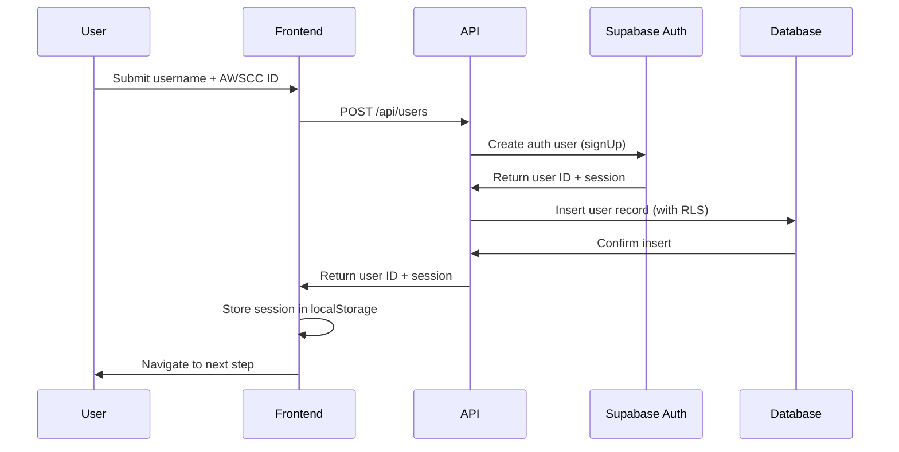
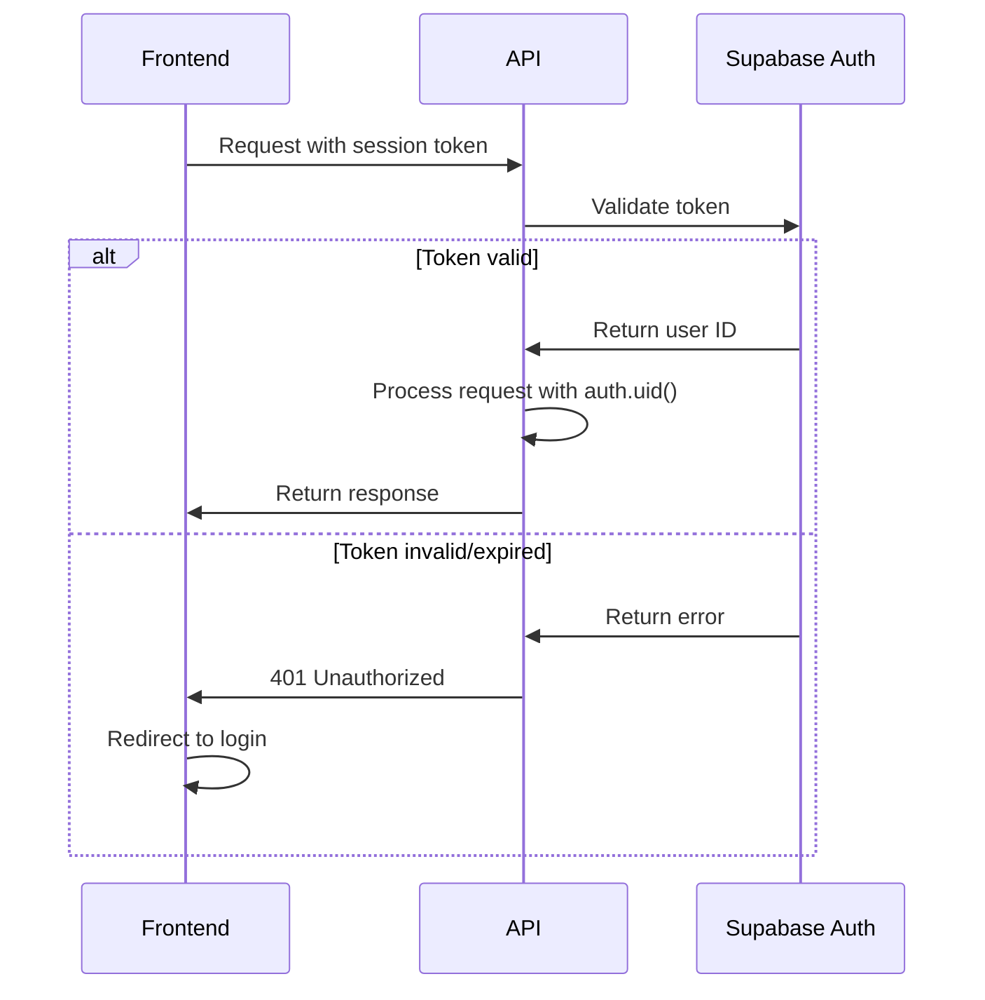

# Supabase Authentication Setup Guide

This guide explains how to configure Supabase authentication for the AWS Community Showcase platform.

## Overview

The platform uses Supabase Auth for user session management with the following flow:
1. Users complete onboarding and provide username + AWSCC ID
2. Backend creates a user record and Supabase Auth session
3. Session persists across page refreshes
4. Protected endpoints validate session tokens

## Authentication Configuration

### 1. Supabase Dashboard Setup

#### Enable Email/Password Authentication

1. Go to your Supabase project dashboard
2. Navigate to **Authentication** → **Providers**
3. Enable **Email** provider
4. Configure the following settings:

```yaml
Email Provider Settings:
  - Enable Email provider: ✅ ON
  - Confirm email: ❌ OFF (for development)
  - Secure email change: ✅ ON
  - Secure password change: ✅ ON
```

**Note**: For production, you should enable email confirmation and configure email templates.

#### Configure Auth Settings

Navigate to **Authentication** → **Settings**:

```yaml
General Settings:
  - Site URL: http://localhost:3000 (development)
  - Site URL: https://your-domain.com (production)
  - Redirect URLs: 
    - http://localhost:3000/**
    - https://your-domain.com/**

JWT Settings:
  - JWT expiry: 3600 (1 hour)
  - Refresh token expiry: 2592000 (30 days)

Security Settings:
  - Enable phone confirmations: ❌ OFF
  - Enable email confirmations: ❌ OFF (development)
  - Enable email confirmations: ✅ ON (production)
```

### 2. Environment Variables

Ensure your `.env.local` file contains:

```bash
# Supabase Configuration
NEXT_PUBLIC_SUPABASE_URL=https://your-project.supabase.co
NEXT_PUBLIC_SUPABASE_ANON_KEY=your-anon-key-here
SUPABASE_SERVICE_ROLE_KEY=your-service-role-key-here
```

**Where to find these values:**
1. Go to Supabase Dashboard → **Settings** → **API**
2. Copy **Project URL** → `NEXT_PUBLIC_SUPABASE_URL`
3. Copy **anon public** key → `NEXT_PUBLIC_SUPABASE_ANON_KEY`
4. Copy **service_role** key → `SUPABASE_SERVICE_ROLE_KEY`

⚠️ **Security Warning**: Never commit `.env.local` to version control. The service role key bypasses all RLS policies.

### 3. Client Configuration

The Supabase client is already configured in `src/lib/supabase.ts`:

```typescript
// Client-side client (for Client Components)
export const supabase = createClient(supabaseUrl, supabaseAnonKey, {
  auth: {
    persistSession: true,      // Store session in localStorage
    autoRefreshToken: true,    // Auto-refresh before expiry
  },
});

// Server-side client (for API routes)
export const supabaseAdmin = () => {
  return createClient(supabaseUrl, serviceRoleKey, {
    auth: {
      persistSession: false,   // No session storage on server
      autoRefreshToken: false, // No auto-refresh on server
    },
  });
};
```

## Authentication Flow

### User Registration (Onboarding Step 2)



### Session Validation (Protected Endpoints)



## Implementation Examples

### 1. Creating a User with Auth Session (API Route)

```typescript
// app/api/users/route.ts
import { supabaseAdmin } from '@/lib/supabase';
import { NextRequest, NextResponse } from 'next/server';

export async function POST(request: NextRequest) {
  try {
    const { username, awsccId } = await request.json();
    
    const admin = supabaseAdmin();
    
    // Create auth user (generates a random email for now)
    const { data: authData, error: authError } = await admin.auth.signUp({
      email: `${username}@temp.awscommunity.local`,
      password: crypto.randomUUID(), // Random password
    });
    
    if (authError) throw authError;
    
    // Create user record (RLS allows insert if auth.uid() = id)
    const { data: userData, error: userError } = await admin
      .from('users')
      .insert({
        id: authData.user!.id,
        username,
        awscc_id: awsccId,
      })
      .select()
      .single();
    
    if (userError) throw userError;
    
    return NextResponse.json({
      userId: userData.id,
      session: authData.session,
    }, { status: 201 });
    
  } catch (error) {
    return NextResponse.json(
      { error: 'Failed to create user' },
      { status: 500 }
    );
  }
}
```

### 2. Validating Session in Protected Endpoint

```typescript
// app/api/projects/route.ts
import { supabase } from '@/lib/supabase';
import { NextRequest, NextResponse } from 'next/server';

export async function POST(request: NextRequest) {
  try {
    // Get session from request headers
    const authHeader = request.headers.get('authorization');
    if (!authHeader) {
      return NextResponse.json(
        { error: 'Unauthorized' },
        { status: 401 }
      );
    }
    
    // Validate session
    const { data: { user }, error } = await supabase.auth.getUser(
      authHeader.replace('Bearer ', '')
    );
    
    if (error || !user) {
      return NextResponse.json(
        { error: 'Invalid session' },
        { status: 401 }
      );
    }
    
    // User is authenticated, proceed with request
    const { title, description, mediaUrl } = await request.json();
    
    const { data, error: insertError } = await supabase
      .from('projects')
      .insert({
        title,
        description,
        media_url: mediaUrl,
        author_id: user.id, // RLS ensures this matches auth.uid()
      })
      .select()
      .single();
    
    if (insertError) throw insertError;
    
    return NextResponse.json(data, { status: 201 });
    
  } catch (error) {
    return NextResponse.json(
      { error: 'Failed to create project' },
      { status: 500 }
    );
  }
}
```

### 3. Client-Side Session Management

```typescript
// components/AuthProvider.tsx
'use client';

import { createContext, useContext, useEffect, useState } from 'react';
import { supabase } from '@/lib/supabase';
import type { Session } from '@supabase/supabase-js';

const AuthContext = createContext<{
  session: Session | null;
  loading: boolean;
}>({
  session: null,
  loading: true,
});

export function AuthProvider({ children }: { children: React.ReactNode }) {
  const [session, setSession] = useState<Session | null>(null);
  const [loading, setLoading] = useState(true);
  
  useEffect(() => {
    // Get initial session
    supabase.auth.getSession().then(({ data: { session } }) => {
      setSession(session);
      setLoading(false);
    });
    
    // Listen for auth changes
    const {
      data: { subscription },
    } = supabase.auth.onAuthStateChange((_event, session) => {
      setSession(session);
    });
    
    return () => subscription.unsubscribe();
  }, []);
  
  return (
    <AuthContext.Provider value={{ session, loading }}>
      {children}
    </AuthContext.Provider>
  );
}

export const useAuth = () => useContext(AuthContext);
```

### 4. Making Authenticated Requests

```typescript
// components/CreateProjectForm.tsx
'use client';

import { useAuth } from './AuthProvider';
import { useState } from 'react';

export function CreateProjectForm() {
  const { session } = useAuth();
  const [title, setTitle] = useState('');
  const [description, setDescription] = useState('');
  
  const handleSubmit = async (e: React.FormEvent) => {
    e.preventDefault();
    
    if (!session) {
      alert('You must be logged in to create a project');
      return;
    }
    
    const response = await fetch('/api/projects', {
      method: 'POST',
      headers: {
        'Content-Type': 'application/json',
        'Authorization': `Bearer ${session.access_token}`,
      },
      body: JSON.stringify({ title, description }),
    });
    
    if (response.ok) {
      const project = await response.json();
      console.log('Project created:', project);
    } else {
      console.error('Failed to create project');
    }
  };
  
  return (
    <form onSubmit={handleSubmit}>
      <input
        type="text"
        value={title}
        onChange={(e) => setTitle(e.target.value)}
        placeholder="Project title"
      />
      <textarea
        value={description}
        onChange={(e) => setDescription(e.target.value)}
        placeholder="Project description"
      />
      <button type="submit">Create Project</button>
    </form>
  );
}
```

## Testing Authentication

### 1. Test User Creation

```bash
curl -X POST http://localhost:3000/api/users \
  -H "Content-Type: application/json" \
  -d '{
    "username": "testuser",
    "awsccId": "AWSCC-001"
  }'
```

Expected response:
```json
{
  "userId": "abc-123-def-456",
  "session": {
    "access_token": "eyJhbGc...",
    "refresh_token": "xyz...",
    "expires_in": 3600
  }
}
```

### 2. Test Protected Endpoint

```bash
# Without token (should fail)
curl -X POST http://localhost:3000/api/projects \
  -H "Content-Type: application/json" \
  -d '{
    "title": "My Project",
    "description": "Test project"
  }'

# With token (should succeed)
curl -X POST http://localhost:3000/api/projects \
  -H "Content-Type: application/json" \
  -H "Authorization: Bearer eyJhbGc..." \
  -d '{
    "title": "My Project",
    "description": "Test project"
  }'
```

### 3. Test Session Persistence

1. Create a user and get session token
2. Store token in browser localStorage
3. Refresh the page
4. Verify session is restored automatically
5. Make authenticated request with restored session

## Troubleshooting

### "Invalid JWT" Error

**Cause**: Token is expired or malformed

**Solution**:
1. Check token expiry: `jwt.io` to decode token
2. Ensure auto-refresh is enabled in client config
3. Verify `NEXT_PUBLIC_SUPABASE_ANON_KEY` is correct

### "User not found" Error

**Cause**: User record doesn't exist in database

**Solution**:
1. Verify user was created in both Auth and database
2. Check RLS policies allow user creation
3. Ensure `auth.uid()` matches user record ID

### Session Not Persisting

**Cause**: localStorage not working or session config incorrect

**Solution**:
1. Check `persistSession: true` in client config
2. Verify localStorage is enabled in browser
3. Check for CORS issues if using different domains

### RLS Policy Violations

**Cause**: Trying to access data without proper authentication

**Solution**:
1. Verify user is authenticated: `supabase.auth.getUser()`
2. Check RLS policies match your use case
3. Use service role key for admin operations (server-side only)

## Security Best Practices

1. **Never expose service role key**: Only use in server-side code
2. **Validate all inputs**: Don't trust client-provided data
3. **Use HTTPS in production**: Protect tokens in transit
4. **Enable email confirmation**: Verify user email addresses
5. **Implement rate limiting**: Prevent abuse of auth endpoints
6. **Rotate keys regularly**: Update service role key periodically
7. **Monitor auth logs**: Check for suspicious activity in Supabase dashboard

## References

- [Supabase Auth Documentation](https://supabase.com/docs/guides/auth)
- [Next.js Authentication Patterns](https://nextjs.org/docs/authentication)
- Requirements: 19.1, 19.2, 19.3, 19.4, 19.5
